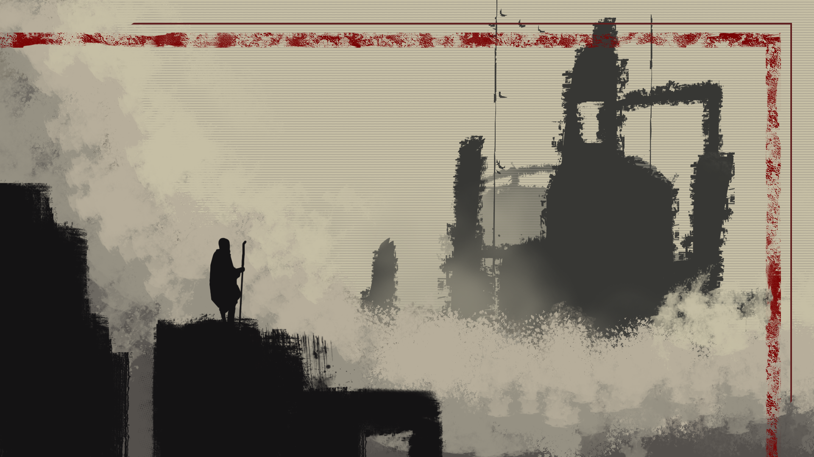
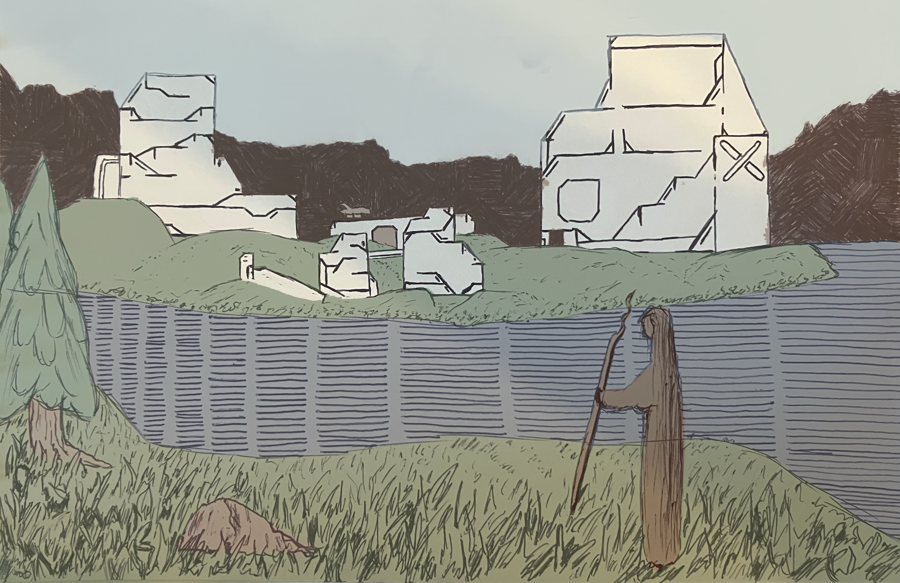

Rebel Engine
============

Games. Made by humans. With love. 🏴‍☠️

## About Us
We are a small team of four that are making their way in the indie development world. We've created a number of silly projects in the past, participating in game jams and self-funded explorations in games technology.

With all of the those experiences and years of development experience combined, we're taking on our first major release slated for release in July of 2027.

We're eager to share more! We'll be dropping more information regarding the game here. In the meantime you can learn more about the team below.

### Timeline

- [x] Internal Prototype: September 2026
- [ ] Steam Page: December 2026

### The Team

- **Michael**
  - Architecture and Systems
  - More than a decade of experience developing software in the editing, rendering, and production management arenas. Has helped finish some of the largest blockbusters in history (Marvel, Star Wars) and wants to contribute his passion for systems development to the games industry.
- **Jacob**
  - Development and Design
  - Published two games independently on Steam, [Merchant Isle](https://store.steampowered.com/app/2722600/Merchant_Isle/) and [Stellar Archipelago](https://store.steampowered.com/app/3295680/Stellar_Archipelago/?curator_clanid=44779163). Has a knack for problem solving at any scale and knows how to deliver a product.
- **Conner**
  - Creative Direction and Design
  - Years of Unreal Engine experience creating visualizations for many industries and clients the world over. With the ability to break down a system and find it's flaws, get to the root of the issue, or generally dream up the next best thing - the creative leadership is in good hands.
- **Liam**
  - Story and Lorekeeper
  - After years in the visual effects industry mastering the sight of good looking pixels Liam moved into the world of visualization. He's also spent years honing his story telling capabilities. Now, if there's something in a universe we need thought through, there's no better person to ask.

### Past Projects
Projects from Game Jams and other experimentations that allowed us to hone our skills to the point of starting our own studio.

- Loupe's Doughnuts: https://mccartnm.itch.io/loupes-donuts
- Sir Dice Kicker: https://connerrust.itch.io/sir-dice-kicker
